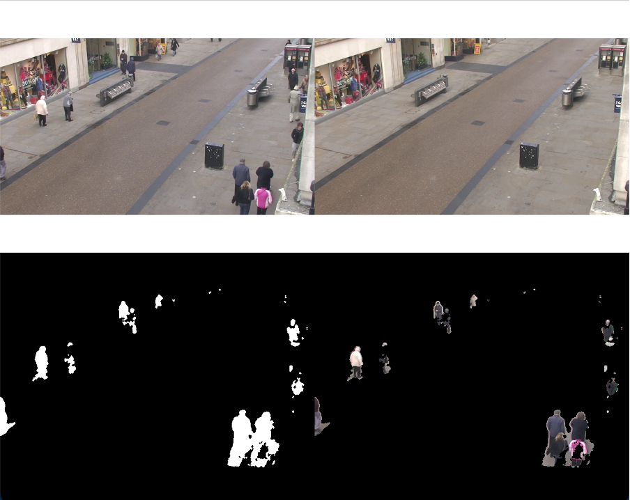
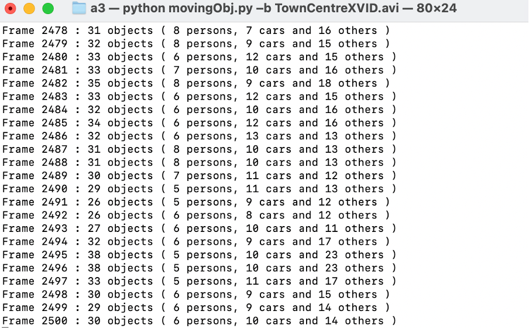
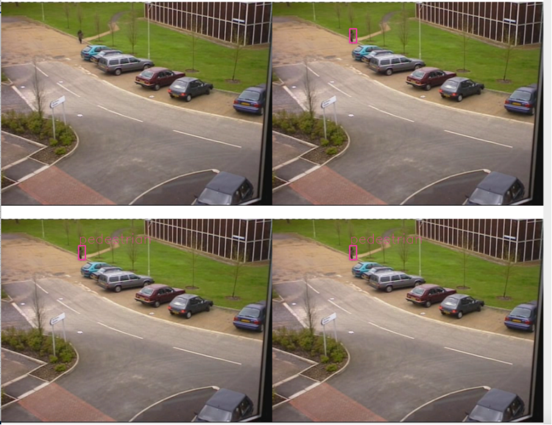

# computer vision - pedestrian detection

 A Python program that extracts and counts moving objects, e.g. people, cars and others using background modelling and detects pedestrians using pre-trained MobileNet SSD object detector.

## Usage

### Run the program as: python movingObj.py -b videofile

Program will execute extracting and counting moving objects using Gaussian Mixture background modelling. Count separate moving objects using connected component analysis, classify each object into person, car and other.

### Run the program as: python movingObj.py -d videofile

Program will detect pedestrians (i.e. persons) using a OpenCV Deep Neural Network
(DNN) module and a MobileNet SSD detector pre-trained on the MS COCO dataset.
